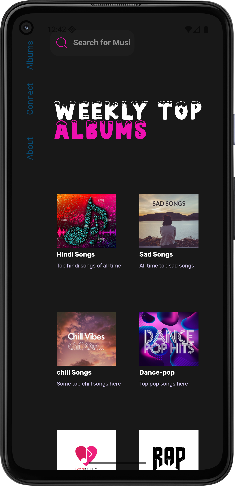
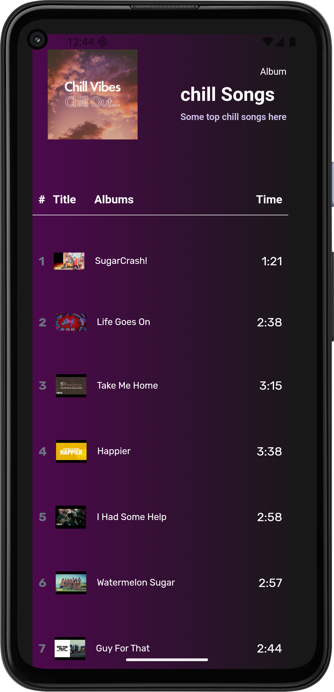

# 🎵 MusicWave – Web to Android App

**MusicWave** is a sleek and lightweight Android application that brings the magic of your favorite web-based music platform right to your phone!  
Built using **WebView**, it delivers the same web experience but with the comfort of a native Android app — no browser tabs, no distractions, just pure music.

---

## ✨ Features

- 🎧 **Full Web Experience** – Enjoy the original website in app form.
- 📱 **Mobile-Friendly UI** – Optimized for Android screens.
- ⚡ **Fast & Lightweight** – Minimal APK size with quick loading.
- 🔒 **Secure** – WebView configured with safe browsing practices.
- 🌙 **Supports Dark Mode** – If your web platform supports it.

---

## 📸 Screenshots

  

---

## 🛠️ Tech Stack

- **Android Studio** – Development environment
- **Kotlin** – Primary language
- **WebView API** – For embedding the music platform
- **Material UI Components** – For a clean Android feel

---

## 📦 Installation

1. **Download the APK** from the releases section.
2. Install it on your Android device.
3. Open the app and start enjoying your favorite tunes.

---

## 💡 How It Works

This app is essentially a wrapper around the web version of the music service, implemented using Android's **WebView** component.  
It keeps all the features of the website but adds:

- An Android app icon for quick access
- In-app browsing without external browsers
- Optional splash screen for a smoother launch

---

## 🚀 Why Use This?

Because sometimes you just want to:
- Skip opening Chrome or any browser
- Get straight into your music
- Have an app icon on your home screen for instant play

---

## 📄 License

This project is for educational and personal use.  
All rights to the original web platform belong to their respective owners.

---
